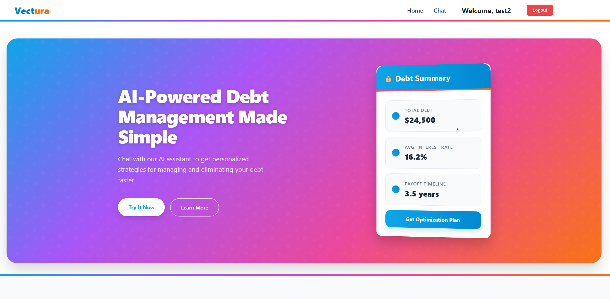
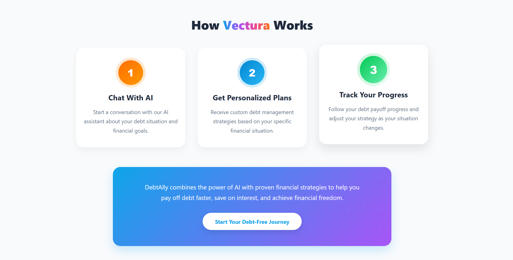
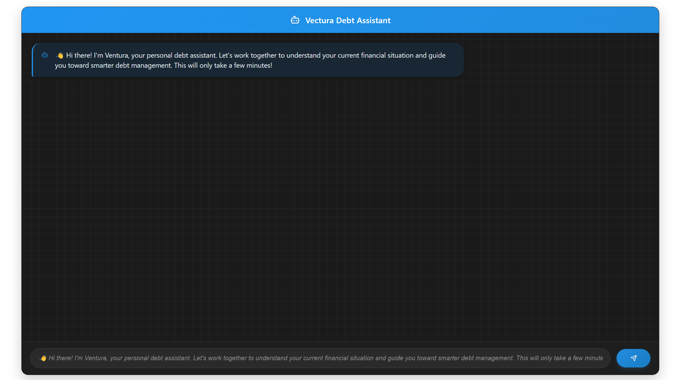
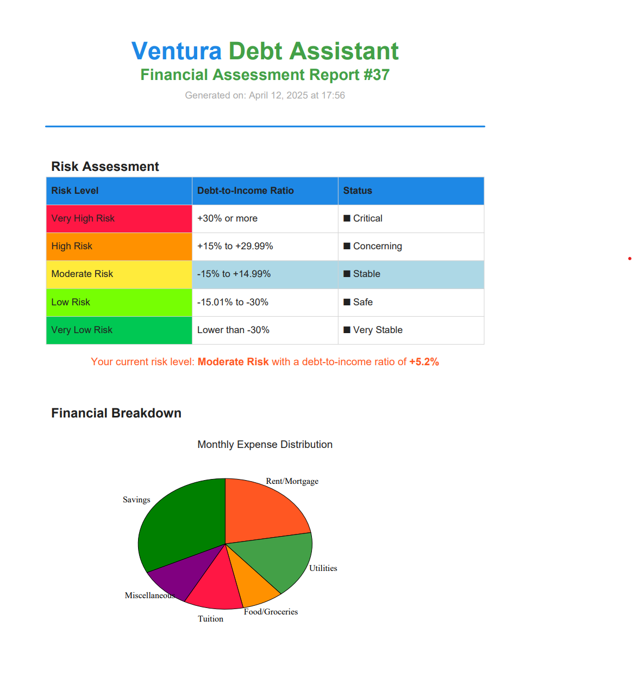
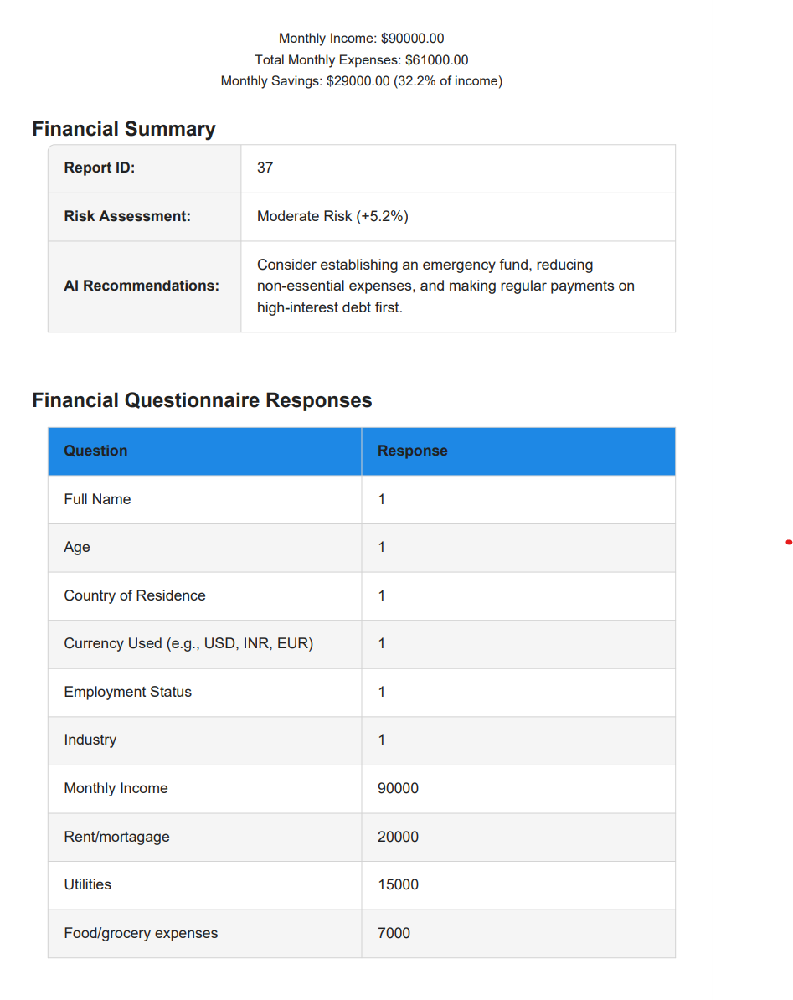

# 💸 Vectura – AI-Powered Debt Assistant

**Vectura** is an intelligent debt consultation assistant that guides users through a personalized financial questionnaire, analyzes their responses, and generates a detailed consultation report in PDF format. 

Designed to empower individuals in understanding and managing their debt more effectively, **Ventura** (our AI chatbot) provides clear insights through a conversational interface powered by AI.

---

## 🧠 Features

- 🤖 **Conversational Chatbot**  
  Friendly chatbot *Ventura* guides users through structured financial questions.

- 📊 **Smart Financial Analysis**  
  Automatically calculates income vs. expenses and detects financial strain.

- 📄 **PDF Report Generation**  
  Downloadable PDF includes:
  - User Profile (name, age, income, etc.)
  - Financial Breakdown (income vs. expenses)
  - Diagnosis & Budgeting Advice

- 📉 **Visual Breakdown**  
  Pie chart visualization for monthly income distribution, including savings.

- 🔐 **Secure Backend**  
  Django-powered REST API for storing and processing data safely.

---

## 🛠️ Tech Stack

| Layer      | Tools Used                             |
|------------|----------------------------------------|
| Frontend   | React, Tailwind CSS                    |
| Backend    | Django, Django REST Framework          |
| PDF Export | ReportLab                              |
| AI Logic   | Conversational simulation via React    |
| Charts     | ReportLab’s `graphics.charts.pie`      |

---

## 🚀 How It Works

1. User opens the chatbot interface.
2. **Ventura** initiates a friendly conversation.
3. User answers financial questions.
4. Responses are sent to the Django backend.
5. Backend performs analysis and generates a **PDF consultation report**.
6. User downloads the PDF with personalized insights.

---

## 🧪 Setup Instructions

### 1. Clone the Repository

```bash
git clone https://github.com/your-username/vectura.git
cd vectura
```

### 2. Backend Setup
```bash
        cd backend
        python -m venv env
        source env/bin/activate  # On Windows: env\Scripts\activate
        pip install -r requirements.txt
        python manage.py migrate
        python manage.py runserver
```

### 3. Frontend Setup
```bash
        cd frontend
        npm install
        npm run dev
```

## 📸 Screenshots

   


   


   


   


   


